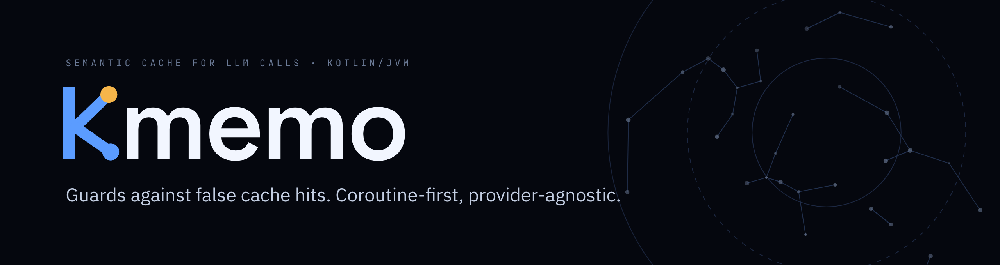

<p align="center">
  
</p>

# Kmemo

**A semantic cache for LLM calls on Kotlin/JVM that refuses to serve you the wrong answer.**

[](https://github.com/NaCode-Studios/Kmemo/actions/workflows/ci.yml)
[](https://central.sonatype.com/artifact/io.github.nacode-studios/kmemo-core)
[](LICENSE)
[](https://kotlinlang.org)
[](https://nacode-studios.github.io/Kmemo/)
[](https://nacodestudios.it/en/project/kmemo)

An exact-match cache misses "how do I reverse a list in Python" when it has already answered "python
list reverse". A semantic cache does not: it embeds the prompt, finds the closest one it has seen, and
replays that answer instead of calling the model. Fewer API calls, lower latency, same answers. Except
for the part where it hands back the wrong one.

```
"Convert 100 USD to EUR"
"Convert 250 USD to EUR"      cosine similarity: ~0.99
```

Every mainstream embedding model scores that pair around 0.99. No threshold separates it from a genuine
paraphrase, because on the similarity axis the near miss sits closer than most paraphrases do. So a
cache built on a threshold alone will tell someone that 250 dollars is 92 euros. Quickly, with no error
and nothing in the logs. Kmemo treats that as the main event: similarity is only the first filter, and
candidates that clear it are read as text by a chain of guards looking for concrete evidence the answers
must differ.

```kotlin
val cache = SemanticCache(
    embedder = Embedder { text -> openAi.embed(text) },
    store = InMemoryStore(maxEntries = 10_000, ttl = 1.hours),
)

val answer = cache.getOrPut(prompt) { llm.complete(it) }
```

Kmemo caches responses for embeddings you already have. `openAi.embed` above is your own embedding
source; Kmemo ships none and depends on no provider SDK.

> **See it end to end.** [`examples/`](examples) is a runnable demo (no API key needed) that shows a
> guard catching a live near miss, with a `docker-compose` for the Redis store.

> **Status — `1.1`, stable.** The cache, the ten guards, the in-memory / Redis / Postgres / HNSW stores,
> the threshold calibrator, an optional verifier, observability (events, Micrometer, SLF4J), a
> `CachePolicy` veto for data that must never be persisted, and Spring Boot / Spring AI / LangChain4j /
> Ktor integrations are implemented and measured against a labelled corpus. The public API is stable
> under SemVer; see [STABILITY.md](STABILITY.md).

## Why Kmemo

- Ten lexical checks catch near misses a threshold cannot: swapped numbers, units, entities, time
  references, negation, flipped antonyms, reversed comparisons, a different answer being asked for.
  They run against a labelled corpus on every build, and the numbers are reported honestly. See
  [Correctness, measured](#correctness-measured).
- The costs are asymmetric. A wrong rejection costs one API call; a wrong acceptance costs a wrong
  answer. The defaults follow that, and the guards abstain rather than guess.
- `ThresholdCalibrator` measures the right threshold for *your* embedding model. A value from a blog
  post was tuned for somebody else's.
- `Embedder` and `CacheStore` are one-method seams. Bring OpenAI, Cohere, Voyage or a local ONNX
  model; start in memory and move to a vector database without touching the match logic.
- Every operation is a `suspend` function, and `kmemo-core` declares `kotlinx-coroutines-core` as its
  only dependency.

## Installation

Requires JDK 17+. Artifacts are published to Maven Central under `io.github.nacode-studios`.

```kotlin
dependencies {
    implementation("io.github.nacode-studios:kmemo-core:1.1.0")
}
```

You also need an embedding source, which is any function from `String` to `FloatArray`. Multi-module
users can pin one version with the BOM (`io.github.nacode-studios:kmemo-bom`); every module past
`kmemo-core` is opt-in and never lands on the core classpath.

## Usage

### Caching a call

`getOrPut` embeds the prompt once and reuses the vector for both the lookup and the write:

```kotlin
val answer = cache.getOrPut(prompt) { llm.complete(it) }
```

Concurrent callers asking the same thing are coalesced: the first computes, the rest wait and are served
its answer.

### Reading a miss

A cache whose hit rate is 4% is untunable unless you know *why*, because the fix is opposite for a
threshold miss and a guard rejection. Every miss says which:

```kotlin
when (val result = cache.lookup(prompt)) {
    is CacheLookup.Hit  -> result.response
    is CacheLookup.Miss -> when (result.reason) {
        MissReason.BELOW_THRESHOLD   -> // traffic repeats less than you assumed, or threshold too tight
        MissReason.REJECTED_BY_GUARD -> // a guard found a concrete difference; result.detail says which
        else -> null
    }
}
```

`cache.explain(prompt)` is a read-only companion that shows every candidate with every guard's verdict.
Reach for it when a hit you expected did not happen.

### Scopes

Anything that changes what a correct answer looks like belongs in the scope: model, temperature, system
prompt, tenant, language. Leave one out and the cache serves one model's answer to another model's
caller.

```kotlin
cache.getOrPut(prompt, scope = "gpt-4o|t=0.0|v3") { llm.complete(it) }
```

### Choosing guards

```kotlin
SemanticCache(embedder)                                    // MatchGuards.standard()
SemanticCache(embedder, guards = MatchGuards.strict())     // trades hit rate for margin
SemanticCache(embedder, guards = MatchGuards.none())       // the naive similarity-only baseline
```

The guards work outside English too. Curated packs ship for Italian, Spanish, German and French, each
covered by a localized near-miss test set. Those sets are hand-written and in-sample, so they are a
regression check on the packs, not a blind measurement like the English corpora further down:

```kotlin
SemanticCache(embedder, guards = MatchGuards.standard(Locale.ITALIAN))
```

### Typed and streaming responses

Cache more than a `String`: a structured object through a `ResponseCodec`, or a streamed answer
replayed as a `Flow` on a hit, where only a stream that completes cleanly gets cached.

```kotlin
val weather: Weather = cache.getOrPut(prompt, weatherCodec) { llm.extractWeather(it) }

cache.getOrPutStreaming(prompt) { llm.completeStreaming(it) }.collect { print(it) }
```

### Observability

`stats()` gives lifetime counters (hit rate, per-reason and per-guard misses). For dashboards and logs,
subscribe to the event stream instead. It costs nothing when unused:

```kotlin
val metrics = KmemoMetrics().also { it.bindTo(meterRegistry) }   // kmemo-micrometer
val cache = SemanticCache(embedder, listeners = listOf(metrics, Slf4jCacheListener()))
```

### Resilience

The `Embedder` is a network call on every lookup, so own its failure. Fall back to the model when it is
down, retry transient blips, and warm the cache from an FAQ at startup:

```kotlin
val cache = SemanticCache(
    embedder = myEmbedder.retrying(maxAttempts = 4),
    embedFailurePolicy = EmbedFailurePolicy.FALL_BACK_TO_COMPUTE,
    negativeCacheSize = 10_000,
)
cache.warm(faqPairs.map { WarmEntry(it.question, it.answer) })
```

Falling back is never silent: every degraded call moves `stats().degradedLookups` and emits a
`CacheEvent.Degraded` naming the operation and the cause. A cache that has quietly become a
pass-through is otherwise the one failure mode with no telemetry pointing at it.

### What must never be cached

The cache stores prompts and responses verbatim. `CachePolicy` is the seam that vetoes a write for data
that must not be persisted at all — consulted once per write, on every write path including `warm`:

```kotlin
val cache = semanticCache(embedder) {
    cachePolicy = CachePolicy { prompt, response, _ ->
        if (containsPii(prompt) || containsPii(response)) PolicyVerdict.Veto("pii") else PolicyVerdict.Store
    }
}
```

A vetoed write is a policy decision, not a failure: the call still returns its computed response, and
the veto surfaces as `CacheEvent.WriteVetoed` and `stats().writesVetoed` rather than being
indistinguishable from a miss. Kmemo ships the seam and no detector, for the same reason `Embedder` and
`Verifier` are seams. Isolation *between* tenants is a different problem and is already `scope`, which
the store TCK has enforced on every store since M4.

### Verifying what lexical guards cannot see

About a third of near misses get past the guards on the blind splits: 25 of 86 on held-out, 34 of 102 on
validation. That residual is what an optional `Verifier` exists for — typically a cheap model call, it
runs only on candidates that already cleared the threshold and every guard, and it fails closed: a
timeout or an error rejects rather than serving something unconfirmed. Cases like `deworm a puppy` vs
`an adult dog` or `boiling point of ethanol` vs `methanol` turn on world knowledge no lexical check has.
How much of the residual a verifier actually catches has not been measured yet.

## Architecture

| Module | Contents |
| --- | --- |
| `kmemo-core` | `SemanticCache`, the `Embedder` and `CacheStore` seams, the guard chain, `InMemoryStore`, `ThresholdCalibrator`, resilience, the `CacheEvent` stream, with no provider or database knowledge. |
| `kmemo-store-redis` | A `CacheStore` on Redis (RediSearch KNN), for a cache shared across processes. |
| `kmemo-store-postgres` | A durable `CacheStore` on Postgres / pgvector. |
| `kmemo-store-hnsw` | An opt-in in-process approximate (HNSW) `CacheStore` that scales past the exact scan. |
| `kmemo-micrometer` / `kmemo-slf4j` | A Micrometer `MeterBinder` and an SLF4J logging listener. |
| `kmemo-spring-boot-starter` / `kmemo-spring-ai` | Auto-config for a `SemanticCache` bean, and a caching `Advisor` for Spring AI's `ChatClient`. |
| `kmemo-langchain4j` / `kmemo-ktor` | A caching `ChatModel` wrapper, and a Ktor server plugin. |
| `kmemo-bom` | A `java-platform` BOM to pin one version. |

A lookup is decided in stages, each cheaper than the one it protects:

```
prompt ─► embed ─► nearest 5 in scope ─► similarity ≥ threshold?
                                              │ no ─► MISS (below_threshold)
                                              ▼ yes
                                         guards ─► reject? ─► try next candidate ─► MISS (rejected_by_guard)
                                              ▼ pass
                                         verifier (optional) ─► reject? ─► MISS (rejected_by_verifier)
                                              ▼ pass
                                             HIT
```

### Correctness, measured

The guards are judged against three labelled corpora with blind splits that no guard was tuned against,
run as a CI regression gate on every build. **These figures are guard-only**: `CorpusTest` runs
`MatchGuards.standard()` with no `Verifier` in the loop, so they describe the free lexical layer rather
than the cache as a whole. On the validation split, near misses are rejected 67% of the time and
paraphrases are kept 88%; on the held-out split, 71% and 88%. Neither is 100%. The near misses that get
through are what the optional `Verifier` is for, but its catch rate on them is not measured here and is
not folded into these numbers. How the blind splits grow without getting contaminated is written up in
[docs/CORPUS.md](docs/CORPUS.md); reproduce the numbers with:

```bash
./gradlew :kmemo-core:test --tests '*CorpusTest*'
```

## Roadmap

**Shipped (`1.0.0`).** The guarded semantic cache, calibrated thresholds and an optional verifier;
Redis, Postgres and HNSW stores behind one `CacheStore` seam; resilience (embed-failure fall-back,
retries, negative caching, `warm`); observability (a `CacheEvent` stream, Micrometer, SLF4J);
ergonomics (typed and streaming `getOrPut`, a config DSL, a BOM); multilingual guard packs
(IT/ES/DE/FR); and Spring Boot, Spring AI, LangChain4j and Ktor integrations with a runnable
[`examples/`](examples) demo. The public API is stable under SemVer.

**Shipped (`1.1.0`).** The first slice of Tier 6: a `CachePolicy` veto for data that must never be
persisted, enforced at the single choke point every write goes through; telemetry for the one failure
mode that previously left no trace, an embed failure that degrades a `getOrPut` to an uncached call; and
an honesty pass on the published corpus numbers, which are now labelled guard-only.

**Next.** An exact-match fast path that answers a repeated prompt without embedding it at all; shadow
mode, which runs the full lookup against your own traffic and reports what *would* have matched at a
range of thresholds without serving anything, so the threshold is calibrated before a single cached
answer goes out; invalidation beyond TTL, for when the fact behind an answer changes; and a comparative
false-hit benchmark against GPTCache and a threshold-only baseline.

**Later.** Kotlin Multiplatform (`commonMain`) for on-device, browser and edge caches, and
advanced matching (reranking/MMR, near-duplicate eviction, quantized candidates with exact rescoring,
adaptive thresholds).

The plan lives on the [Kmemo board](https://github.com/orgs/NaCode-Studios/projects/5) — one item per milestone, each with its exit
criterion — and every tier is a [milestone](https://github.com/NaCode-Studios/Kmemo/milestones) in this repository. See
[STABILITY.md](STABILITY.md) for the versioning and stability policy.

## Building and testing

```bash
./gradlew build         # compile, run unit tests, lint (ktlint + detekt), verify public API
./gradlew apiCheck      # check the tracked public API in *.api
./gradlew apiDump       # regenerate *.api after an intentional public-API change
./gradlew ktlintFormat  # auto-fix formatting before committing
```

Unit tests need no external services. The store integration tests spin up real backends with
[Testcontainers](https://testcontainers.com) and are skipped automatically when Docker is unavailable.

## Contributing

Contributions are welcome; see [CONTRIBUTING.md](CONTRIBUTING.md). Please run `./gradlew build` before
opening a pull request, and if you change the public API, run `./gradlew apiDump` and commit the
updated `*.api` files.

## License

Licensed under the [Apache License 2.0](LICENSE). Brand assets (wordmark, symbol, and the colour and
type tokens) are in [`docs/brand`](docs/brand).

## Sponsor

If Kmemo is useful to you, consider [sponsoring NaCode Studios](https://github.com/sponsors/NaCode-Studios).
